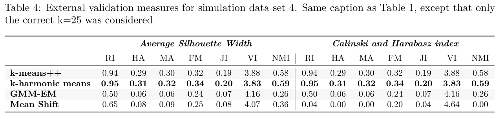

```{r setup, include=FALSE}
knitr::opts_chunk$set(echo = TRUE)
```

This document will compare four frequently used clustering algorithms, Gaussian Mixture Models Expectation Maximization (GMM-EM), k-means++, k-harmonic means (KHM), and mean shift (MS).  First, a comparison of their model assumptions, implementations, and time complexities will be conducted.  Then simulation studies will demonstrate scenarios in which each algorithm will outperform the others. The strengths and weaknesses of all four algorithms will be highlighted followed by a brief discussion on the types of data that are most appropriate for each method.

## Gaussian Mixture Models Expectation Maximization (GMM-EM)

As will be the case for all clustering algorithms discussed, GMM-EM clustering aims to cluster data points
$X \subset \Real{}^d$ into k clusters, where k is known ahead of time. GMM-EM does so by utlilizing a Gaussian Mixture Model, a mixture of k multivariate Gaussian distributions with mean vector $\mu_k$ and $dXd$ covariance matrix $\Sigma_k$ [@P.Murphy1991]:

$$
p(x_i|\theta) = \sum_{k=1}^{K} \pi_k N(x_i|\mu_k, \Sigma_k)
$$

where $x_i$ is the ith data point in $X \subset \Real{}^d$ and $\pi_k$ is the mixing probability. Now, assume that
$x_i$ was generated from (unknown) Gaussian component, $z_i$. For GMM-EM clustering, we want to maximize the following log likelihood:

$$
\sum_{i = 1}^N log (p(x_i|\theta)) = \sum_{i=1}^{N} log (\sum_{z_i} p(x_i, z_i|\theta))
$$

Because this likelihood is difficult to optimize [@P.Murphy1991] the expectation maximization (EM) algorithm [@McLachlan2008] is used instead. Define the complete data log likelihood, $l_c(\theta) \coloneqq \sum_{i=1}^N logp(x_i, z_i|\theta)$.  Since $z_i$ is unknown, the expectation (E) step of the algorithm computes expected complete likelihood instead:
$$
Q(\theta, \theta^{t-1}) = E[l_c(\theta)|X, \theta^{t-1}]
$$
Then, in the (M) step $Q(\theta, \theta^{t-1})$ is optimized wrt $\theta$ to obtain an estimate for $\theta_t$ in the $t$th iteration:

$$
\theta_t = \underset{\theta}{argmax} Q(\theta, \theta^{t-1})
$$
These steps are iterated until the max number of iterations or some convergence criteria is reached.  In this document, the `mclust` package was used [@Dempster1977], so the convergence criteria was $\lVert L_t - L_{t-1}  \rVert < \epsilon$, where $L_t = \sum_{i=1}^{N}logp(x_i|\theta^t)$ and $\epsilon = 10^{-5}$. The probability that a data point, $x_i$, belongs to mixture component $z_k$ can be computed using Bayes rule:

$$
p(z_k|x_i) = \frac{p(x_i|z_k, \theta)p(z_k|\theta)}{p(x|\theta)}
$$
This provides a "soft clustering" of the data, but a "hard clustering" may be attained by assigning each observation to the component with the highest probability.

During GMM-EM clustering, different constraints on the covariance matrices, $\Sigma_k$, will result in assumptions of differently shaped clusters.
A fully flexible model (without constraints, "VVV" in `mcclust`) would result in clusters with variable volume, shape, and orientation.  However, increasing the parameter state can increase the chance that the optimization algorithm will be trapped in local optima [@Zhang1999]. The only flexibility required by the simulations in this study was the "EII" model  in `mcclust`, which constrains the clusters to have equal volume and shape and orientation. This corresponds to the constraint that $\Sigma_k = \lambda\M{I}$, where $\lambda$ is a constant specifying the clusters volume, $\M{I}$ is a $dXd$ identity matrix .

Intializing the parameter estimates, $\theta^1$ is an important step in the GMM-EM algorithm, as a poor intialization can result in the algorithm being trapped in local optima.  `mcclust` by default uses hierarchical clustering to find the initial partitioning of the data for estimation of $\theta^1$.  Because I wanted to try clustering from several random intializations and investigate how this affected the clustering results, I instead used a random partitioning of the data to initialize $\theta^1$.

The computational complexity of this algorithm per iteration is $O(nkd)$ if a diagonal covariance matrix is assumed for the Gaussian likelihood.  The most expensive step is computing $p(x_i|\theta)$ for all n observations and k mixtures.  The most expensive step in computing $p(x_i|\theta)$ is the Mahalanobis distance which is $O(d)$.  If one is using the most general covariance structure model, then the complexity of GM-EMM is $O(nkd^2 + kd^3)$, because one needs to compute k covariance matrix inversions for the Mahalanobis distance, which is $O(kd^3)$. Then, the Mahalanobis distance involves a matrix vector multiplication that is $O(d^2)$.  

Under certain constraints, the EM algorithm is guaranteed to converge to a local optima, but this convergence can be slow [@McLachlan2008] if there are many parameters in the model.

## k-means++

For the k-means clustering problem, the clusters are defined
by their k centers, $\V{c}$, which are chosen such that the following loss function is minimized:

$$
Loss = \sum_{x \in X} \underset{x \in \V{c}}{min} \lVert x - c \rVert_2
$$

An exact algorithm for this problem is NP-hard.  However, Lloyd's k-means algorithm provides an approximate local search solution that is both fast and simple [@Lloyd1982].  This comes at price though, as there are no guarantees about the quality of the approximation.  In fact, there are non-pathological examples where the quality of the approximation is unbounded [@Arthur].

The k-means algorithm starts by selecting at random k data points to be the cluster centers, each with equal probability.  Data points are assigned to the nearest center.  Then, the cluster centers are updated with the centroid of each cluster. These steps are repeated until convergence.  The k-means++ algorithm [@Arthur] modifies this procedure so that the k data points selected as the initial cluster centers are selected with a probability defined by their contribution to loss function.

Define $D(x)$ as the shorted distance from x to its nearest cluster center. The algorithm proceeds as follows:

1. Choose the cluster center, $c_1$,  at random from the data points, $X$, with equal probability.
2. Reset the center $c_i$ to $x^* \in X$ with probability $\frac{D(x^*)^2}{\sum_{x \in X} D(x)^2}$. Do this $\forall i \in {2,...,k}$. 
3. For each i, define cluster $C_i \subset X$ as the set of points that are
closest to $c_i$.
4. For each i, let $m = \lvert C_i \rvert$ set new cluster center $c_i = \frac{1}{m} \sum_{x \in C_i} x$.
5.  Repeat Steps 3 and 4 until clustering does not change.

In total, the computational complexity of each iteration is $O(nkd)$. The most expensive step in the algorithm is the computation of the distance from each cluster center for each observations, which is $O(nkd)$.  Arthur et al. show that this modification to the k-means algorithm results in a $O(log(k))$ approximation of the optimal k-means solution and that k-means++ outperforms k-means in terms of both speed and accuracy on many empirical data sets.

Interestingly, the k-means algorithm can be written as a special case of the EM-GMM algorithm, where the $\pi_i$ are all equal and sum to one (equal mixing probabilities), and the covariance matrices are equal, diagonal and small [@P.Murphy1991].  This means 
that k-means constrains clusters to be spherical and equal in size, whereas EM-GMM clusters can have more general shapes by assuming more general covariance structures.

I used my own code for selecting the initial centers for k-means++, and then the `k-means` function in the `stats` package (using the LLoyd algorithm) for the remaining clustering procedure. k-means++ was run for 100 iterations or until convergence.

## k-harmonic means (KHM)

The k-harmonic means (KHM) algorithm [@Zhang1999] is similar to the k-means algorithm, except that the loss function has been modified.  Instead of minimizing the distance of $x_i$ from the closest center, KHM minimizes the harmonic mean of the distance between $x_i$
and all cluster centers:

$$
LOSS = \sum_{i=1}^{n} \frac{k}{\sum_{j=1}^{k} \frac{1}{\lVert x_i - c_j \rVert^2}}
$$
Plots and proofs provided by [@Zhang] demonstrate that this loss function is shaped similarly to the loss function in k-means.  However the KHM loss is smooth and differentiable.  This means that the KHM function is easier to optimize and less likely to be trapped in local optima [@Zhang1999].  Importantly, Zhang et al. demonstrate that when $x_i$ is very close to a cluster center, both loss functions are essentially zero.

By taking the derivative of the loss function wrt each cluster center, $c_j$, and setting this equal to 0, the following recursive formula for $m_k$ is obtained, where $d_{i,k} = \lVert x_i - c_j \rVert$:

$$
m_k = \frac{\sum_{i=1}^{N}\frac{1}{d_{i,k}^3(\sum_{l=1}^{K}\frac{1}{d_{i,k}^2})^2} x_i}{\sum_{i=1}^{N}\frac{1}{d_{i,k}^3(\sum_{l=1}^{K}\frac{1}{d_{i,k}^2})^2}}
$$
This typically broken into multiple steps shown in [@Zhang1999].

As in Lloyd's k-means algorithm, KHM could be terminated once the cluster assignments do not change after an iteration, but this was not implemented in the code I used, which was modified from the code here: [https://github.com/nishanthu/k-harmonic-means].
KHM was run for 100 iterations in each simulation.

As in k-means, the most expensive step in the algorithm is the computation of the distance from each cluster center for each observation.  Therefore, the algorithm is $O(nkd)$ as well. Zhang et al. did not prove convergence for this algorithm, but 
state that numerical results suggest super linear convergence.

## Mean shift (MS)

Mean shift is an entirely different approach to clustering.  The mean shift algorithm [@Fukunaga1975] is a non-parametric gradient estimation method, which can be used to find the modes in a probability density function (pdf).   Non-parametric means that no assumptions about the form of the distributions generating the data are assumed (as opposed to GMM-EM, which assumes that the mixture distributions are normal).  Mean shift can estimate the modes of complex, multimodal pdfs, which can then be used to detect arbitraily shaped clusters of the generated data [@Comaniciu]. The description of these algorithms have been adapted from [@Alorf2017].  A multivariate kernel density estimator is first selected for each data point, $x_i$. There are many choices,
but I have used the most common normal kernel:

$$
K(x) = ce^{-\frac{1}{2} \lVert x \rVert ^2}
$$
Where c is a normalizing constant.  We initialize $x$ to be any data point in X.  Next, the "mean shift vector" is computed:

$$
m(x) - x  = \frac{\sum_{i=1}^{n}x_i K(\lVert \frac{x - x_i}{h} \rVert^2)}{K(\lVert \frac{x - x_i}{h} \rVert^2)} - x
$$
This is the difference between the weighted mean of all of the data and x, the center of the kernel.  The mean shift vector points in the direction of the maximal increase in the density, or the gradient, of the non parameteric pdf. By setting $x \leftarrow m(x)$, x is shifted towards the nearest mode of the pdf.  By iterating this procedure on each data point, each observation will be assigned to the nearest mode in the pdf, resulting in a clustering determined by the modes, $\V{c}$. 

Unlike the previous cluster methods, $k$, or the number of clusters, does not need to be provided in advance.  The only tuning parameter is $h$, the bandwidth parameter which can heavily influence the clustering result.  As $h$ becomes larger, points further away from the
center become more heavily weighted in the mean, resulting in an increase in the "window size".  Changing this parameter can dramatically change the clustering result.  A large $h$ will lead to a larger number of clusters.  This parameter often needs to be tuned in a data driven manner in order to find a sensible number of clusters.  Too large of $h$ will result in distinct clusters being merged, while too small of $h$ will create many spurious clusters and lead to poor convergence times [@Alorf2017].

Selection of $h$ is non-trivial with most of the proposed methods being both computationally intensive and lacking in rigorous evaluation [@Chacon].  Often these methods are focused on estimating the mean intergrated square error of $D\hat{f}_H$, 
the estimate of the kernel density gradient:

$$
MISE(H) = \int \lVert D\hat{f}_H(x) - Df(x) \rVert^2 
$$

The optimal bandwidth minimizes $MISE(H)$.  Since the true kernel density gradient is not known, several methods have been developed to approximate $MISE(H)$ given the data. For example a cross-validation procedure previously demonstrated to work well in the univariate case [@Park1990], has recently been extended to abritary d-dimensional distributions with an efficient computational solution provided by Chacon et al. [@Chacon2014]. These appproaches were too difficult to implement and so I chose a more heuristic approach explained later on.

I used the pacakge `LPCM` to implement the mean shift alogorithm [@Gallant2011]. The data were scaled prior to clustering as this aids in convergence and interpretation for their bandwidth parameter.

Several sources I found stated that the complexity of the mean shift alogrithm per iteration was $O(n^2)$ [@Hyrien2016].  However, I think it must be $O(n^2d)$ as the mean shift alogrithm requires a pair wise euclidean distance matrix to be computed which is $O(n^2d)$.  These distances are needed to compute the mean shift vector for every data point at each iteration.

## Model Performance Measures

Consider comparing $C$, the partitioning of the 
data determined by the cluster labels, and $C'$ the partitioning determined by the "true" labels to quantify their disagreement.

Let:

* a be number of pairs that are clustered together in $C$ and are clustered together in $C'$
* b be number of pairs that are clustered together in $C$ and are not clustered together in $C'$
* c be number of pairs that are not clustered together in $C$ and are clustered together in $C'$
* d be number of pairs that are not clustered together in $C$ and are not clustered together in $C'$

The four measures provided by the clues package [@Wang2007] in R for the external validation of clustering are:


$$
\begin{aligned}
&\textrm{Rand Index (RI): } (a + d)/(a + b + c + d) \\
&\textrm{Adjusted Rand Index (ARI): } (a + d - n_c)/(a + b + c + d - n_c)  \\
&\textrm{Fowlkes and Mallows  (FM): } a / ((a + b)(a + c))^2 \\
&\textrm{Jaccard Index (JI): } a/(a + b + c)\\
\end{aligned}
$$


RI [@Wang2007] is a measure of the agreement between the clustering and the true class labels computed by matching pairs.
It is the number of true positives (a) plus the number of true negatives (d) over all possible 
pairings.  The advantage of this measure is that it is intuitive and highly interpretable.  However, one problem with RI is that $E[RI] \rightarrow 1$ as  $k \rightarrow n$ where k is the number of clusters and n the number of data points. This means RI cannot
be computed for all possible values of k and then used to select the number of clusters.  The FM [@Fowlkes1983] measure adjusts the RI so that the value of k with the largest FM can be used to select the number of clusters. However, this transformation makes interpretation of the measure more challenging. JI is similar to the RI, except that it does not consider true negatives, the
pairs with separate class labels that are correctly in separate clusters.  

The main problem with RI, FM, and JI is that they do not correct for the value that would be expected by chance, under a random clustering.  Two versions of the ARI do for correct this, each with a different correction factor, $n_c$.  Morey and Agresti (MA) suggested the first ARI [@Morey1984].  Hubert and Arabie (HA)
demonstrated that MA still leaves some positive bias and provided their own ARI [@Hubert1985].  HA was used as the primary measure of external validation as this was shown by Milligan and Cooper [@Milligan1986] to have the best validation properties in a simulation study.

Another external validation measure used is variation of information (VI) [@Meila2007], which uses measures of entropy of $C$ and $C'$ to quantify their disagreement.
Entropy is a measure of uncertainity in a random variable, which here is the partition membership of each data point.
Specifically, variation of information is the sum of two conditional entropies $H(C|C')$ and $H(C'|C)$, where
$H(C|C')$ is the amount of information about $C$ that is lost by going from partition $C$ to partition $C'$.
$H(C|C')$ can also be expressed as $H(C) - I(C, C')$, where $H(C)$ is the entropy of $C$ and $I(C, C')$ is the joint entropy of
$C$ and $C'$.  VI has different interpretation from the previous criteria, which were summary measures of a confusion matrix.  Rather, VI can be thought of as comparing the relationship each data point has with either partition. This provides unique and complementary information about the agreement between two partitions.

Normalized mutual information is similar to 
VI, except that NMI uses $I(C, C')$, normalized by the sum of $H(C)$ and $H(C')$,  to quantify the agreement of the $C$ and $C'$.
One limitation of this measure is that it has been shown to be biased toward larger numbers of clusters [@Amelio].

## Selection of the number of clusters

For clustering procedures besided mean shift, the number of clusters (k) needed to be selected prior to clustering.  I used two procedures to determine which k achieved a reasonable partitioning of the data. First, I selected the k value that resulted in the highest average silhouette width (ASW) [@Rousseeuw1987] for cluster assignments. By maximizing the ASW, I aimed to find the most "natural" number of clusters in the data, in which cluster members are most similar to each other, and distant from members belonging to other clusters. This criteria was used because it intuitively captures the way we visually define clusters in data.  More formally, let a(i) be the average distance between $x_i$ and all other members of its cluster, and b(i) be the smallest average distance between $x_i$ and the members of any other cluster. Then the silhouette for  $x_i$, s(i), is:

$$
s(i)= \frac{b(i)-a(i)}{max(a(i),b(i))}
$$

Overall, the ASW is the average of the silhouette values for all $x_i$. Next, I used the Calinski and Harabasz criterion [@Calinski1974] to select the number of clusters.  The CH is a F statistic for the test for significant differences in the cluster means:

$$
\frac{B(k)/(k-1)}{W(k)/(n-k)}
$$
Where $B(k)$ and $W(k)$ are the between and within sum of squares for the k clusters.  It is calle a "pseudo F statistic" because it does not account for the covariances in observations.  The higher the F stastic the better separated the k clusters are, providing greater evidence for natural clustering.   In a simulation study, Milligan and Cooper compared 30 different criteria for selecting the number of clusers and found that CH had the best performance [@Milligan1985].

In general I found that the ASW outperformed the CH in identifying the true number of clusters in the data.  CH often found the optimal number of clusters to be a number much higher than the truth.

For the mean shift algorithm the bandwidth parameter, h, needed to be selected.  I used Eisenbock's automated procedure for selecting the optimal bandwidth parameter on a grid using a measure of the largest jump in the self coverage curve, provided in the package `LPCM` [@Gallant2011]. The h parameter in `LPCM` is highly interpretable as it is simply a percentage of the range of each (scaled) variable. If I had more time I would have computed the mean shift clustering over a grid of values and pick the bandwidth parameter that maximizes the ASW and CH criteria. 

## Simulation study design and results

### Simulation 1: MS method of choice

The first simulation was designed so that the mean shift algorithm would outperform the other methods. $x_i \in \mathbb{R}^2, \ i = 1,..., 300$ were simulated according to a mixture of the following distributions:

**$f(x)_1$**: The first coordinates of
$x$, $x_{i1}$, were iid $N(0, 1.5)$.  The second coordinate was generated st $x_{i2} = x_{i1} + x_{i1}^2 + e_{i2}$, where the $e_{i2} \overset{iid}{\sim} N(0, 1)$.

**$f(x)_2$**: The first coordinates of
$x$, $x_{i1}$, were iid $N(0, 1)$.  The second coordinate was generated st 
$x_{i2} = -15 + x_{i1} + x_{i1}^2 + x_{i1}^3 + e_{i2}$, where the $e_{i2} \overset{iid}{\sim} N(0, 1)$.

**$f(x)_3$**:  $x_i \overset{iid}{\sim} MVN(\mu, \Sigma)$ where $\mu = (-4,-4)$ and $\Sigma = \M{I}_{2x2}$.

The mixing probabilities of these three distribution, $(\pi_1, \pi_2, \pi_3)$, were $(1/2, 1/3, 1/6)$.  **Figure 1** shows a data set simulated from this distribution.  The distribution is a mixture containing highly non-Gaussian distributions.  $f(x)_1$ and $f(x)_2$ have substantial
curvature in the contours of their densities and the clusters they generated are far from elliptical.

**Table 1** shows the external validation of each of the clustering algorithms. Again, the value of k was determined according to the ASW and CH criteria.  The MS algorithm did not need to choose k, so the same performance meaures are presented for both criteria.   The clustering according to MS clearly matches the true clustering the best with a much higher HA score. All other validation measures were clearly optimal.  **Supplementary Figures** shows how the clustering matches the truth almost exactly.  The other clutering methods either clustered data from **$f(x)_1$** and **$f(x)_3$** together or split the data into smaller spurious clusters.

The reason why MS outperformed all other methods on this data set was that it does not make any assumptions about the parametric form of the disitribution that the data were generated from.  MS excels at finding cluster centers in highly non-Gaussian distritbutions such as these. GMM-EM assumes that the data are generated from a mixture of Gaussians. The fact that k-means clustering is a special case of a GMM implies that both k-means++ and KHM also make the same assumption.  While all these clustering methods cannot detect data generating distributions in the data, they can still provide a reasonable estimate of the structure in the data by increasing the number of clusters and fitting the regions of the data that  violate the model assumptions (i.e. the tails of the distribution where there is large contour curvature) with separate Gaussians. This was frequently the solution found to be optimal by these methods.  All of the suboptimal methods still had high adjusted Rand indices, a low VI index and high NMI index. This demonstrates that we do not need to assume the data is generated by a mixture of Gaussians in order to cluster with GMM-EM algorithms.

```{r, echo=FALSE, out.width = '100%'}

```

### Simulation 2: GMM-EM method of choice

The second simulation was designed so that the GMM-EM algorithm would outperform the other methods. $x_i \in \mathbb{R}^2, \ i = 1,..., 300$ were iid according to a mixture of two bivariate Gaussians.  Both of the distributions were of the form $MVN(\mu, \Sigma)$ with $\mu = (1, 1)$, $(\sigma_1, \sigma_2) = (2, 8)$. The $\rho$ correlation parameter differed between the two distributions. $f(x)_1$ had $\rho = .8$ and $f(x)_2$ had $\rho = -.8$.  The mixing proportions, $(\pi_1, \pi_2)$, were $(3/4, 1/4)$.  This demonstrated how the GMM-EM algorithm can estimate different mixing proportions, as opposed to k-means, which assumes these proportions to be equal. 

The structure of the covariance of the GMM-EM algorithm was less constrained in this simulation to illustrate how GMM-EM can fit more general covariance structure than k-means. The only flexibility required was the "EEV" model in `mcclust`, which constrains the clusters to have equal volume and shape, but allows them to have variable orientation. This corresponds to the constraint that $\Sigma_k = \lambda\M{D_k}\M{A}\Tra{\M{D_k}}$, where $\lambda$ is a constant specifying the clusters volume, $\M{A}$ is a diagonal matrix specifiying the shape of the density contours, and $\M{D_k}$ is an orthogonal matrix that determines cluster orientation [@Scrucca].

This simulation demonstrates an advantage that GMM-EM algorithm has over the other methods -- it is capable of detecting clusters of data generated from distributions that are concentric and have different covariance structure. Both of the underlying distributions of these data have the same mean, but their different covariance structure results in differently shaped, ellipsoid clusters.  Because GMM-EM performs soft clustering, it can assign high probability of membership to both clusters in the regions  where the two Gaussians overlap.  The likelihood that the non-overlapping regions were generated from two elliptical Gaussians is high and the likelihood that the overlapping regions belong to either distribution is high, so the GMM-EM estimates that the data was generated by the correct mixture of distributions.  However, some of the data at the overlap that belonged to the distribution with lower $\pi$ was assigned to the higher $\pi$ distribution, because the higher $\pi$ results in a higher probability of cluster membership.  This created some errors in classification and brought the external validation measures down, but overall the classification was very good (**Table 2**).  HA and MA are much larger than 0, indicating a much better clustering that random chance. RI is .8. VI is low and NMI is high.

Since k-means clustering assumes equal and diagonal covariances for its clusters, both k-means++ and KHM are incapable of identifying the differently oriented clusters.  Both methods break the data into two equally sized and oriented clusters, which is no better than random clustering.  This is captured by their near zero HA and MA external validation measures. MS groups all observations into one cluster.  This was expected as the MS algorithm is a mode finding algorithm and there is only one mode in this mixture distribution.  MS is incapable of finding distinct clusters in concentric mixture distributions.  

```{r, echo=FALSE, out.width = '100%'}

```


### Simulation 3: k-means++ method of choice

The third simulation was designed so that the k-means++ algorithm would outperform the other methods. $x_i \in \mathbb{R}^2, \ i = 1,..., 205$ were iid according to three distributions.  

**$f(x)_1$**: The first 100 observations.  $x_{i1} \overset{iid}{\sim} N(0, 1)$ and $x_{i2} \overset{iid}{\sim} N(4, 1)$.

**$f(x)_2$**: The second 100 observations.  $x_{i1} \overset{iid}{\sim} N(0, 1)$ and $x_{i2} \overset{iid}{\sim} N(0, 1)$.

**$f(x)_3$**: The last 5 observations, heavy outliers. $x_{i1} \overset{iid}{\sim} N(50, 1)$ and $x_{i2} \overset{iid}{\sim} N(0, 1)$

This simulations was adapted from a data set generated by Christian Hennig which can be found here: [http://www.homepages.ucl.ac.uk/~ucakche/presentations/cladagtutorial.pdf].  The data set was originally generated to highlight the sensitivity of GMM-EM clustering to outliers.  Even though the GMM-EM model is specified correctly ("EII", spherical clusters with equal volume), GMM-EM is not capable of finding the three clusters in the data.  During the GMM-EM algorithm, the gross outliers are grouped with one of the other mixture components leading to a poor estimate of the Gaussian distribution parameters. This creates an unreasonable and unstable clustering [@Hennig2004].  Parameter estimation of the Gaussian parameters such as the mean can be made "arbitrarily bad" by a single outlier.  

The novel insight this tutorial provides into this problem is that the k-means++ is often capable of detecting these three clusters near perfectly.  **Table 3** shows one of these examples when k-means++ substantially outperforms all three other methods. Since this result depends on the random intialization of the cluster centers,
the simulation was performed many times with different random seeds to confirm the reproducibility of the results. The k-means++ clustering selected by the CH criterion has a substantially lower VI measure, much higher NMI and higher adjusted rand indices than any other clustering procedure. 

The clustering solutions found by other methods (see **Supplementary Figures**) show the reason for this. At k=3, all other cluster methods are trapped in local optima, splitting the two large clusters into three clusters and grouping the outliers with one of the other mixture components.  Only k-means++ is able to correctly identify the cluster of outliers as the third cluster. It does so by finding a good intialization and avoids becoming trapped in local optima as do the other methods.  

During the center intialization, k-means++ assigns a cluster center to a random data point, which is likely to be one of the large clusters.  Then, the next data point is selected as a center based on the contribution to the loss.  This means that a likely choice for the next center is one of the outliers.  The remaining center will likely be selected from the cluster that has not been sampled from yet.  This ideal initialization results in an easy cluster solution.  Another way to look at this is that k-means++ takes advantage of the upper bound on its approximation of the optimal k-means solution [@Arthur].  Grouping these outliers into one of the larger clusters can make the loss arbitarily larger than the optimal k-means solution, but k-means++ is guaranteed to find a better solution. 

The automatic procedure for selecting the MS bandwidth found too large of a value.  The bandwidth can be large and separate out the outliers, but it needs to be small enough to separate the two clusters that are close together.  Perhaps this is a scenario where an adaptive bandwidth would be appropriate, where the bandwidth varies depending on the data point.  Unfortuntely, this was not implemented in the package I used.

```{r, echo=FALSE, out.width = '100%'}

```

### Simulation 4: KHM method of choice

The fourth simulation was designed so that the KHM algorithm would outperform the other methods.  25 clusters of $x_i \in \mathbb{R}^2, \ i = 1,..., 50$ were simulated.  For each cluster,  $x_i \overset{iid}{\sim} MVN(\mu, .5^2\M{I}_{2x2})$. The $\mu$ vectors for the clusters were placed along a 5X5 grid.  The variances of the $x_i$ coordinates were chosen to be large such that there was little separation between clusters.  For the sake of computational efficiency, only the k = 25 was considered for the number of possible clusters.  Both k-means++ and KHM were run for 100 iterations.

This is a simulated data set that is modeled after the "BIRCH" data set [@Hettich] which was originally developed by UC Irvine and was also used by Zhang et al. [@Zhang1999] to demonstrate that lack of sensitity KHM has to center intialization. 

This simulation demonstrates how KHM can outperform k-means++ when a large number of cluster centers need to be detected.  Even though there is good chance that a k-means++ center will intialize well, there are many cluster centers that need to intialized in this simulation.  By chance, some of these centers will be initialized poorly and then Zhang et al. [@Zhang1999] have demonstrated that Lloyd's k-means is more likely to be trapped in local optima than KHM (because of its smooth, differentiable loss function).  The best KHM clustering performs slighly better than k-means++ in terms of the HA and MA, which are most reliable since the correct for scores that would be expected by chance  (**Table 4**).  This result was reproducible with several random seeds and was more noticeable when the size of the grid was expanded. 

GMM-EM had substantially worse external validation measures.  This is because when clusters are close together, GMM-EM tends to combine clusters, particulary with the "EII" covariance model.  Zhang et al. demonstrated that the GMM-EM, k-means, and KHM loss functions can be represented as a mixture of exponential functions [@Zhang1999].  When clusters are close together, the loss is maximized at the midpoint between the two clusters for GMM-EM in cases when it is maximized at the true cluster centers for k-means and KHM.  

k-means and KHM perform much better at detecting the distinct clusters in this simulation -- GMM-EM groups most of these clusters into large clusters.  MS also merges many of the neighbor clusters together.  Apparently the bandwidth that was selected was too large.  Selection of the correct bandwidth parameter is challenging in this case because the clusters are overlapping.

```{r, echo=FALSE, out.width = '100%'}

```


### Simulation 5: wall clock run times

A very simple simulation study was used to assess the wall clock run times of each method.  $x_i \in \mathbb{R}^d, \ i = 1,..., N$ were generated from a mixture of two Gaussians with equal mixing probabilities. Both had the form $x_i \overset{iid}{\sim} MVN(\mu, \M{I}_{2x2})$. The $\mu$ for the first cluster was $(-2, -2)$ and the $\mu$ for the second was $(2, 2)$. The values of N considered were $(400, 800, 1600, 3200)$ the values of k considered were $(2, 4, 8, 16)$.  All convergence criteria were ignored for each algorithm and each algorithm was run for 100 iterations.  **Figure 2** confirms the time complexity calculations in the earlier section.  As the input size increase, MS run times increase quadratically, while all other run times increase linearly. As d, the dimension of $x_i$, increases all run times seem to increase linearly at worst.  Interestingly, the GMM-EM algorithm does not show much change in run times as the number of variables increases, and KHM only shows a slight linear increase.  The GMM-EM algorithm was very fast for this problem (perhaps it is using some other convergence criteria besides the ones I suppressed?), so noticeable differences in run time may only occur as the size of the problem increases dramatically.  I tried using a much larger N, but saw no noticeable linear trend as d increased.

## Recommendations

Next, I provide a summary of the strengths and weaknesses of each algorithm as discussed so far.

### k-means++

Strengths:

1. Fast. $O(nkd)$, but in practice the LLoyd's algorithm often converges in only a few iterations. 
2. Provides a reasonable intialization that is guaranteed to be a $O(log k)$ approximation of the optimal k-means solution.
3. Performs well in high-dimensional spaces, as there are not many parameters to estimate.

Weaknesses:

1. Need to set k a priori. It is often difficult to know in advance the number of clusters in a data set.  However, there are numerous  well studied heuristics for selecting k.
2. Assumes that clusters are spherical and equal in size, which is often unreasonable for real world data sets.
3. Can become trapped in local optima if an unfortunate intialization occurs.
4. Easy to interpret.  Loss function minimizes the within cluster variance. Also easy to implement.

k-means++ is best used when one wants to get a quick and highly interpretable clustering of a large dataset.  It is particularly useful when data are large both in terms of sample size, n, and the number of variables, d.  It is preferrable to KHM when the runtime is important and one wants to initialize cluster centers intelligently.  It also provides a more interpretable loss function when interpretation of the clusters is desired.  k-means++ is not appropriate when one wishes to detect complex cluster structure in data, as this structure will often be broken into equally sized balls.

### KHM

Strengths:

1. $O(nkd)$ but I could not collect enough data on how many iterations are required for convergence in practice. 
2. Performs well in high-dimensional spaces, as there are not many parameters to estimate.
3. Has a smooth, differentiable loss function that is easy to optimize and is less likely to be trapped in local optima as k-means.

Weaknesses:

1. Need to set k a priori.
2. Assumes that clusters are spherical and equal in size, which is often unreasonable for real world data sets.
3. Less likely to be trapped in local optima, but initialization is still important as selection of poor centers can increase
the number of iterations required for convergence.  Should probably use the k-means++ strategy to intialize.
4. Harder to interpret the loss function than k-means.

KHM has many of the advantages that k-means++ has.  It is useful when both n and d are large.  It has a lower chance of being trapped in local optima, making it an ideal choice when one expects the number of clusters in the data to be large, and the intialization of many cluster centers is a challenge. KHM is not appropriate when one wishes to detect complex cluster structure in data.


### GMM-EM

Strengths:

1. Often the Gaussian model with general covariance structure can approximate complex, real world data distributions. 
2. Clusters can have variable volume, shape, and orientation.  They can also be concentric.  
3. Provides a soft clustering, the probability of membership in each cluster 

Weaknesses:

1. Need to set k a priori.
2. Very sensitive to outliers and cases when clusters are not well separated.  Both cases can lead to unstable solutions.
3. Still need to assume that the data were generated from a parametric distribution, a mixture of Gaussians.
4. As the dimension of the data and the number of mixtures increases, the parameter space can increase dramatically.  This can cause problems with initialization, as parameters will often become stuck in local optima.  Also, the estimates of many parameters can often be unstable, especially when data is scarce.

GMM-EM is best suited to low dimensional data sets where one expects cluster structure to have more complex geometry than simple spheres.  In particular, it can detect clusters of variable sizes better than k-means.  If a simple covariance structure is assumed, GMM-EM is fast ($O(nkd)$) and it can be fast with more complex covariance structures if the dimension is low.  GMM-EM also provides the probability of membership in each cluster if that is desired.  Estimation of GMM-EM parameters becomes troublesome in high dimensional settings and in the presence of outliers

### Mean Shift

Strengths:

1. Can fit arbitrarily complex cluster structures. 
2. Do not need to select k before hand. Only the bandwidth parameter needs to be selected.
3. Once it is selected, the bandwidth parameter (or window size) and its influence on the clustering solution is more interpretable than k.

Weaknesses:

1. The choice of the bandwidth parameter is highly non-trivial.  There are several methods for doing this in a data driven manner, but there has not been much rigorous study of their performance and they are often difficult to implement.
2. It is $O(n^2d)$ which means it is the most computationally intensive method.

MS is the most flexible clustering method.  It is most appropriate when one expects highly non-Gaussian distributions for at least some of the variables in the data.  However it is only computationally feasible when n is small to moderate.  Often tuning the bandwidth parameter such that one finds reasonable clusters is challenging, requiring sophisticated procedures like adaptive bandwidths.

```{r , echo=FALSE, fig.cap= "Simulated data for all four simulation experiments labeled by true class labels. x1 on the x-axis, x2 on the y-axis. Set 1 (topleft), Set2 (topright), Set3 (bottomleft), Set4 (bottomright)", out.width = '75%', out.height = '75%', fig.align="center"}

```

```{r , echo=FALSE, fig.cap= "Wall clock run times as input size or number of descriptors increases with p = 16 or N = 3200 respectively.  The run times (in ms)  were divided by the initial run time.  This was done so that all curves could be fit in one plot concisely.", out.width = '75%', out.height = '75%', fig.align="center"}
knitr::include_graphics("runtimes.pdf")
```

\pagebreak

# References